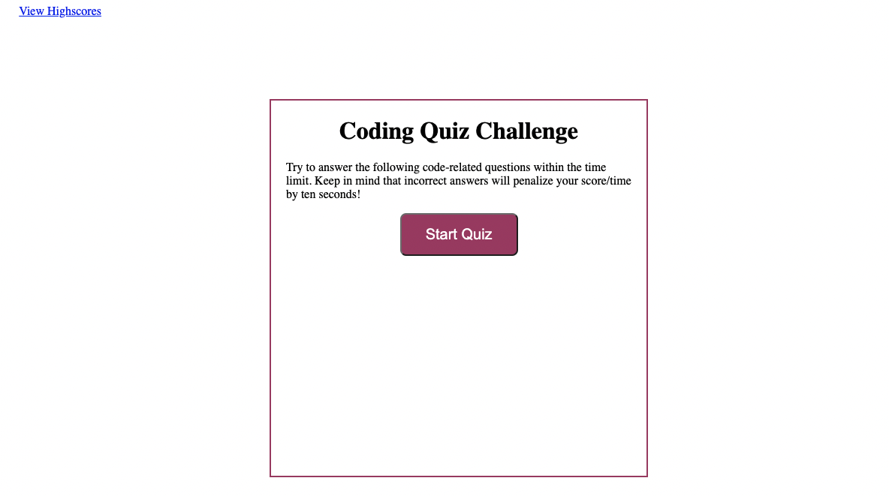
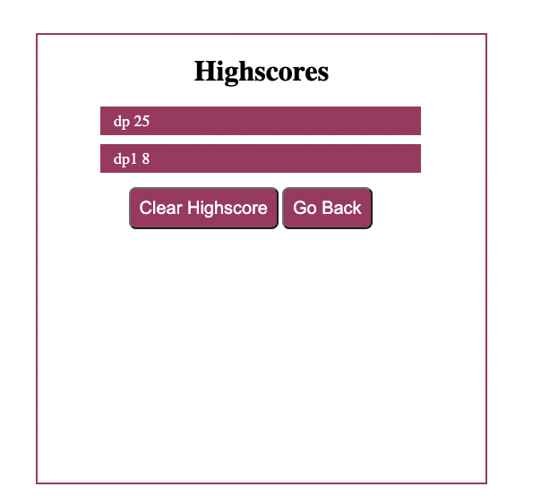

## Table of contents

- [HTML, CSS, JavaScript, and Git:](#html-css-js-and-git)
- [User Story](#user-story)
- [Acceptance Criteria](#acceptance-criteria)
- [Deployment](#deployment)
- [Expected Visuals](#expected-visual)
- [Project Visuals](#project-visual)

## HTML, CSS, JavaScript, and Git:
 04 Web APIs: Code Quiz

## User Story

```
Create a timed quiz on JavaScript fundamentals that stores high scores

```

## Acceptance Criteria

```
GIVEN I am taking a code quiz
WHEN I click the start button
THEN a timer starts and I am presented with a question
WHEN I answer a question
THEN I am presented with another question
WHEN I answer a question incorrectly
THEN time is subtracted from the clock
WHEN all questions are answered or the timer reaches 0
THEN the game is over
WHEN the game is over
THEN I can save my initials and my score
```

## Deployment
Two options are provided the first one is link and second one thats click me that will redirect to the page
- Application deployed to [Github](https://github.com/) : 
  - https://github.com/dparmar32/coding_quiz_challenge/
  - [Click Here](https://github.com/dparmar32/coding_quiz_challenge/)
- Application live GitHub URL submitted link : 
  - https://dparmar32.github.io/coding_quiz_challenge/
  - [Click Here](https://dparmar32.github.io/coding_quiz_challenge/)

## Expected Visual


## Project Visual


---

© 2021 Trilogy Education Services, LLC, a 2U, Inc. brand. Confidential and Proprietary. All Rights Reserved.
